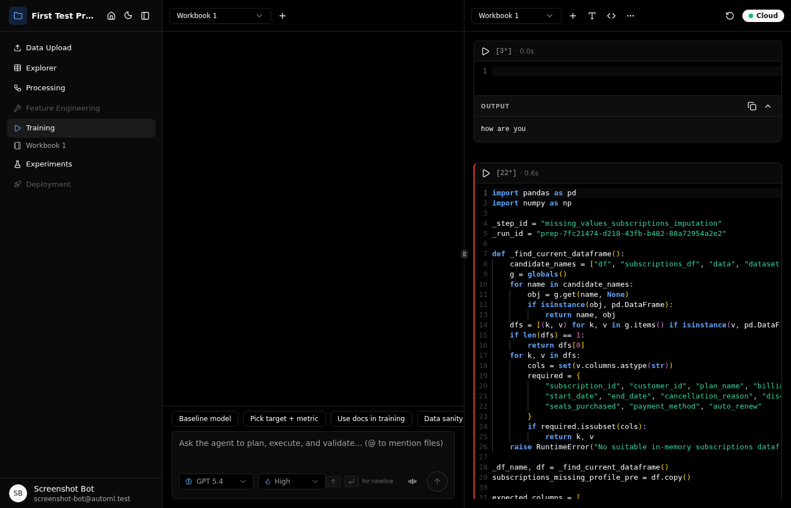
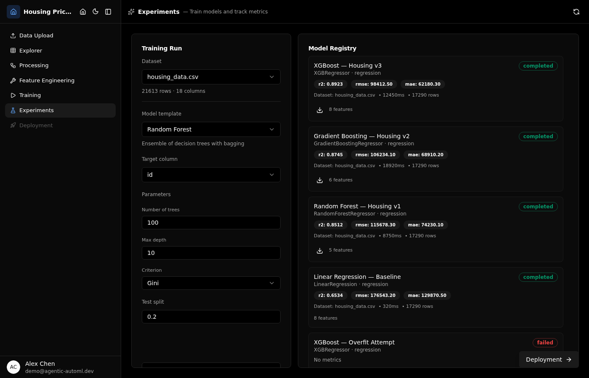

<p align="center">
  
</p>

<p align="center">
  <a href="https://gitlab.csi.miamioh.edu/2026-senior-design-projects/ai-augmented-automl-toolchain/ai-augmented-auto-ml-toolchain/-/commits/main"></a>
  
  
  
  
  
  
</p>

---

**Agentic AutoML Platform** turns datasets and domain documents into production ML models through LLM-orchestrated pipelines. An agentic core powered by LangGraph and MCP tools handles everything from data exploration to model training, while human-in-the-loop approval gates keep the operator in control at every step. It combines NL-to-SQL querying, RAG-powered context, interactive notebooks, and experiment tracking into a single workspace.

## Features

### Agentic AI Core

**LangGraph Workflow Orchestration** — A state-machine execution engine coordinates multi-step ML pipelines through MCP tool calls, with phase-aware routing that selects the right tools for each workflow stage.

**Approval Gates & Bounded Auto-Repair** — Every LLM-generated action passes through user approval before execution. When code cells fail, the agent attempts bounded self-repair within configurable retry limits rather than silently producing bad output.

### Data Intelligence

**NL-to-SQL with Self-Repair** — A 4-phase pipeline translates natural language questions into SQL: intent classification, query generation, execution, and result formatting. Failed queries trigger automatic repair with error context fed back to the LLM.

**RAG with Hybrid Search** — Ingest domain documents (PDF, DOCX, Markdown) to ground LLM responses in your data. Combines embedding similarity with keyword search for cited, context-aware answers.

**Automated EDA** — Statistical profiling with distribution charts, correlation matrices, and missing-value analysis generated automatically on dataset upload.

### ML Automation

**LLM-Guided Preprocessing** — The agent analyzes raw data and generates Python preprocessing code in notebook cells. Each transformation is presented for review before execution, keeping pipelines transparent and editable.

**Automated Feature Engineering** — LLM-proposed derived features with generated transformation code and validation checks, all executed in sandboxed containers.

**Multi-Model Training** — Configurable hyperparameters across multiple algorithms with artifact persistence and reproducible runs.

### Experiment Tracking

**Leaderboard with Champion Detection** — Compare trained models by metrics with automatic champion tagging and a natural language filter bar for slicing results.

**Side-by-Side Comparison** — Overlaid ROC curves, learning curves, and confusion matrices for head-to-head model evaluation.

**Optuna HPO with Live Streaming** — Hyperparameter optimization studies with real-time NDJSON progress streaming to the frontend.

**Error Attribution** — Decision tree analysis of model errors to surface systematic failure patterns.

### Interactive Notebooks

**Monaco Editor with Python Intelligence** — Full-featured code editing with Jedi-powered completions, hover documentation, and syntax highlighting.

**AI-Suggested Cells** — The agent proposes next-step code cells that users accept, reject, or edit before execution.

**WebSocket Sync & Savepoints** — Real-time notebook synchronization with checkpoint/restore for safe experimentation.

**Shadow DOM Rendering** — Kernel HTML output (Plotly charts, DataFrames) rendered in isolated Shadow DOM to prevent style leakage.

### Security & Isolation

**Sandboxed Execution** — Docker containers with read-only root filesystem, non-root user, and configurable memory/CPU limits ensure untrusted code can't escape.

**Persistent Kernel State** — Jupyter Kernel Gateway maintains Python kernel state across cell executions within a session.

## Screenshots

<p align="center">
  
</p>

<details>
<summary>More screenshots</summary>

<table>
  <tr>
    <td></td>
    <td></td>
  </tr>
  <tr>
    <td colspan="2"></td>
  </tr>
</table>

</details>

## Workflow

The platform follows a six-phase progression that mirrors the ML lifecycle:

1. **Upload** — Ingest datasets (CSV, JSON, XLSX) and domain documents (PDF, DOCX, Markdown) into a project workspace.
2. **Explore** — Query data with natural language or SQL, browse automated EDA insights and statistical profiling.
3. **Preprocess** — The LLM suggests data transformations, generates executable code cells, and the user approves before execution.
4. **Features** — The LLM proposes derived features, generates transformation code, and validates outputs.
5. **Training** — Run multi-model training with configurable hyperparameters and persistent artifact storage.
6. **Experiments** — Launch HPO studies, compare models side-by-side, analyze errors, and explore interpretability.

## Tech Stack

| Layer | Technology |
|-------|-----------|
| Frontend | React 19, Vite, TypeScript, Zustand, shadcn/ui, Radix, Tailwind CSS, Monaco Editor |
| Backend | Express 5, TypeScript, LangGraph, MCP SDK, OpenAI SDK, Zod |
| Database | PostgreSQL 16 (metadata, embeddings, notebooks, workflows) |
| Execution | Docker (Python 3.11, scikit-learn, pandas, numpy, Optuna, SHAP) |
| Testing | Vitest (unit), Playwright (E2E), custom eval runner (NL-to-SQL + RAG) |

## Quick Start

**Prerequisites:** Node.js 22 LTS, Docker

```bash
npm run install:all    # Install backend + frontend + testing dependencies
npm run dev            # Boot Postgres, run migrations, start dev servers
```

The dev server starts the backend at `localhost:4000` and frontend at `localhost:5173`.

## Repository Layout

```
backend/              Express 5 + TypeScript API server
  src/routes/         Express routers mounted under /api
  src/services/       Domain logic (LLM, notebook, websocket)
  src/repositories/   File + DB-backed data stores
  migrations/         SQL migration files
frontend/             Vite + React 19 SPA
  src/components/     UI components (shadcn/ui + custom)
  src/stores/         Zustand state management
  src/lib/api/        Typed fetch wrappers
migrations/           Postgres schema migrations (001-008)
scripts/dev/          Dev orchestrator (Docker + migrations + servers)
testing/              Playwright E2E benchmarks + eval runner
docs/                 Branding assets, API contracts, design system
```

## Commands

| Command | Description |
|---------|-------------|
| `npm run dev` | Start development environment (Postgres + migrations + servers) |
| `npm run build` | Build backend (tsc) + frontend (Vite) |
| `npm run test` | Run all tests (Vitest) |
| `npm run lint` | Lint across workspaces |
| `npm run db:migrate` | Run pending migrations (idempotent) |
| `npm run benchmark` | Playwright E2E benchmarks (headless) |
| `npm run eval` | NL-to-SQL + RAG evaluation suite |
| `npm run benchmark:api` | API load benchmarking (autocannon) |

## Documentation

- [`ARCHITECTURE.md`](ARCHITECTURE.md) — System topology and data flow
- [`docs/api-contracts.md`](docs/api-contracts.md) — Request/response contracts
- [`docs/design-system.md`](docs/design-system.md) — UI guidelines and component patterns

## License

[GPL-3.0](LICENSE)
