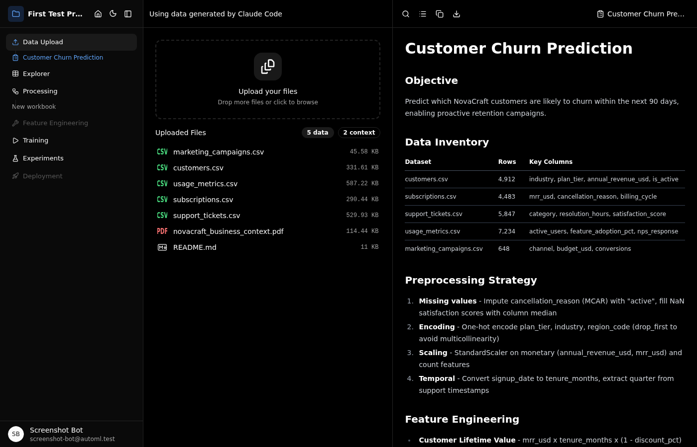
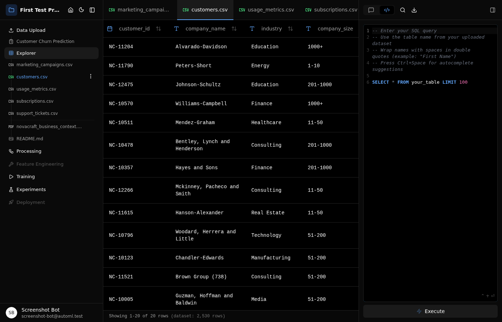
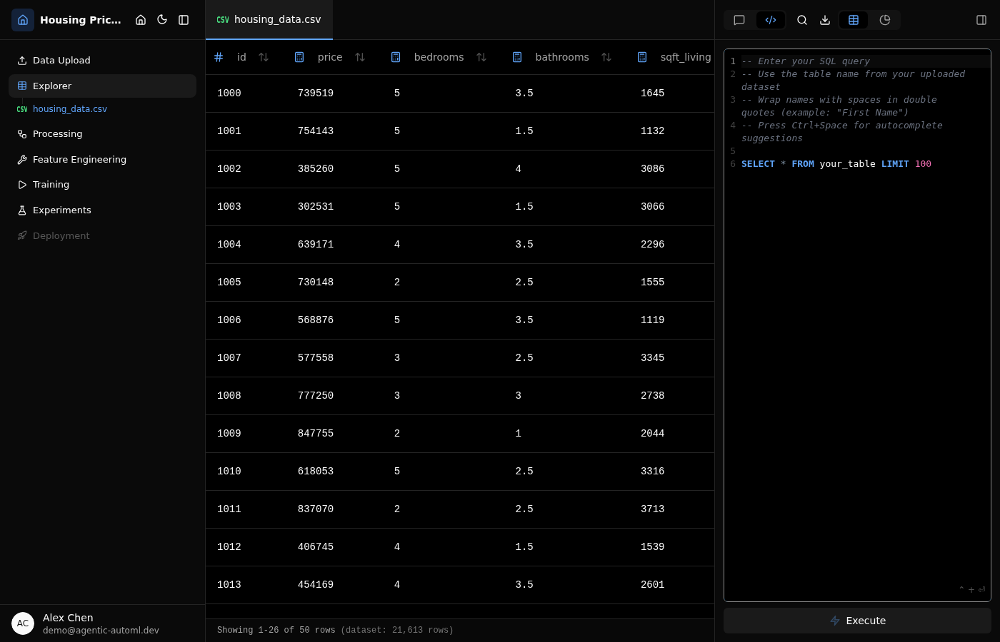
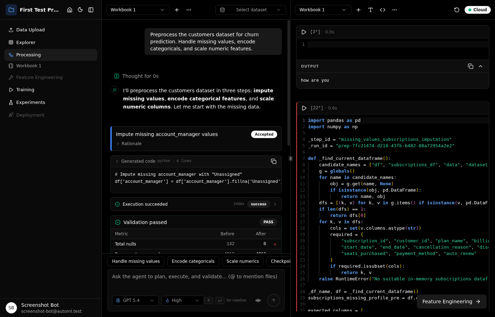
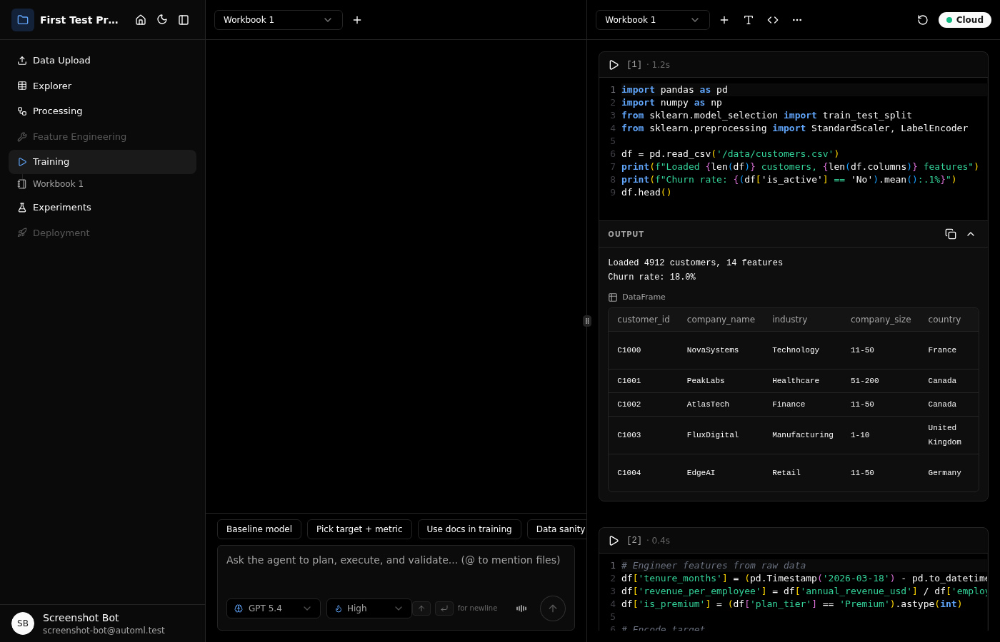
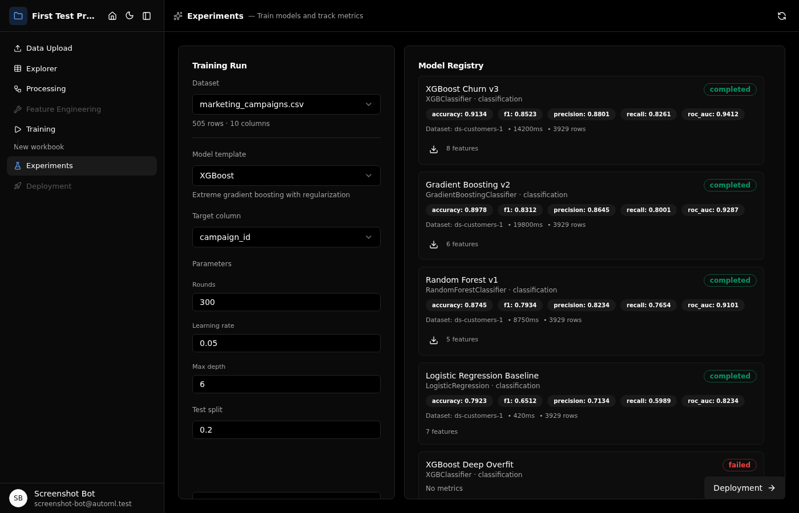

<p align="center">
  
</p>

<p align="center">
  
  
  
  
  
  
  
</p>

---

**Agentic AutoML Platform** turns datasets and domain documents into production ML models through LLM-orchestrated pipelines. An agentic core powered by LangGraph and MCP tools handles everything from data exploration to model training, with human-in-the-loop approval gates at every step.

## Workflow

Six phases mirror the ML lifecycle. Each phase is driven by an LLM agent that proposes actions, generates code, and validates results while the operator approves or edits before execution.

### Upload & Planning

<p align="center">
  
</p>

Ingest datasets (CSV, JSON, XLSX) and domain documents (PDF, DOCX, Markdown) into a project workspace. The LLM agent analyzes uploaded data and creates a structured project plan with recommended preprocessing steps, feature engineering strategies, and modeling approaches.

### Data Exploration

<p align="center">
  
</p>

Automated statistical profiling generates distribution charts, correlation matrices, and missing-value analysis on dataset upload. Column-level statistics, data quality scoring, and interactive visualizations surface patterns and issues before any modeling begins.

### NL-to-SQL Querying

<p align="center">
  
</p>

Query datasets with natural language or raw SQL. A 4-phase pipeline handles intent classification, query generation, execution, and result formatting. Failed queries trigger automatic repair with error context fed back to the LLM.

### Preprocessing

<p align="center">
  
</p>

The LLM agent analyzes raw data and generates Python preprocessing code in notebook cells. Each transformation is proposed, reviewed, executed, and validated through MCP tool calls. Bounded auto-repair retries failed cells with error context rather than silently producing bad output.

### Training

<p align="center">
  
</p>

Train models through an interactive notebook workspace. The agent generates training code, executes cells in sandboxed Docker containers, and reports metrics. Persistent kernel state maintains variables across cell executions within a session.

### Experiments

<p align="center">
  
</p>

Compare trained models on a leaderboard with automatic champion detection and a natural language filter bar. Run Optuna hyperparameter optimization studies with real-time progress streaming. Analyze model errors with decision tree attribution and explore interpretability with SHAP.

## Under the Hood

**LangGraph Orchestration.** A state-machine engine coordinates multi-step ML pipelines through MCP tool calls, with phase-aware routing that selects the right tools for each workflow stage.

**RAG with Hybrid Search.** Ingest domain documents to ground LLM responses in your data. Combines embedding similarity with keyword search for cited, context-aware answers.

**Interactive Notebooks.** Monaco editor with Jedi-powered Python completions, hover documentation, and syntax highlighting. WebSocket sync with savepoints for checkpoint/restore. Kernel HTML output rendered in isolated Shadow DOM.

**Sandboxed Execution.** Docker containers with read-only root filesystem, non-root user, and configurable memory/CPU limits. Jupyter Kernel Gateway maintains Python kernel state across cell executions.

## Tech Stack

| Layer | Technology |
|-------|-----------|
| Frontend | React 19, Vite, TypeScript, Zustand, shadcn/ui, Radix, Tailwind CSS, Monaco Editor |
| Backend | Express 5, TypeScript, LangGraph, MCP SDK, OpenAI SDK, Zod |
| Database | PostgreSQL 16 (metadata, embeddings, notebooks, workflows) |
| Execution | Docker (Python 3.11, scikit-learn, pandas, numpy, Optuna, SHAP) |
| Testing | Vitest (unit), Playwright (E2E), custom eval runner (NL-to-SQL + RAG) |

## Quick Start

**Prerequisites:** Node.js 22 LTS, Docker

```bash
npm run install:all    # Install backend + frontend + testing dependencies
npm run dev            # Boot Postgres, run migrations, start dev servers
```

The dev server starts the backend at `localhost:4000` and frontend at `localhost:5173`.

## Development

### Repository Layout

```
backend/              Express 5 + TypeScript API server
  src/routes/         Express routers mounted under /api
  src/services/       Domain logic (LLM, notebook, websocket)
  src/repositories/   File + DB-backed data stores
  migrations/         SQL migration files
frontend/             Vite + React 19 SPA
  src/components/     UI components (shadcn/ui + custom)
  src/stores/         Zustand state management
  src/lib/api/        Typed fetch wrappers
migrations/           Postgres schema migrations (001-008)
scripts/dev/          Dev orchestrator (Docker + migrations + servers)
testing/              Playwright E2E benchmarks + eval runner
docs/                 Branding assets, API contracts, design system
```

### Commands

| Command | Description |
|---------|-------------|
| `npm run audit` | Audit root, backend, frontend, and testing dependencies |
| `npm run dev` | Start development environment (Postgres + migrations + servers) |
| `npm run build` | Build backend (tsc) + frontend (Vite) |
| `npm run test` | Run all tests (Vitest) |
| `npm run lint` | Lint across workspaces |
| `npm run db:migrate` | Run pending migrations (idempotent) |
| `npm run benchmark` | Playwright E2E benchmarks (headless) |
| `npm run eval` | NL-to-SQL + RAG evaluation suite |
| `npm run benchmark:api` | API load benchmarking (autocannon) |

## Documentation

- [`docs/api-contracts.md`](docs/api-contracts.md) - Request/response contracts
- [`docs/design-system.md`](docs/design-system.md) - UI guidelines and component patterns

## License

[GPL-3.0](LICENSE)
