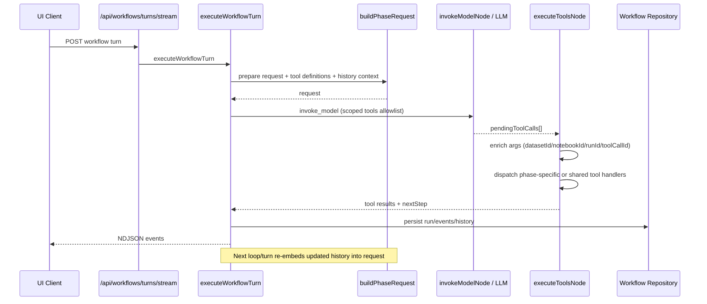

# Backend Workflow Deep Dive Index

This is the cross-linked index for phase-specific backend workflow docs:

- [Processing Tab Backend Deep Dive](./processing-tab-backend-deep-dive.md)
- [Feature Engineering Tab Backend Deep Dive](./feature-engineering-tab-backend-deep-dive.md)
- [Training Tab Backend Deep Dive](./training-tab-backend-deep-dive.md)

## Shared Architecture Map

Shared workflow engine files:

- `backend/src/routes/workflows.ts`
- `backend/src/services/workflows/turnExecutor.ts`
- `backend/src/services/workflows/graph.ts`
- `backend/src/services/workflows/phaseRequestBuilder.ts`
- `backend/src/services/workflows/modelTurnCollector.ts`
- `backend/src/services/workflows/toolExecutor.ts`
- `backend/src/services/workflows/turnFinalizer.ts`
- `backend/src/services/workflows/phaseConfig.ts`

Shared persistence files:

- `backend/src/services/workflows/repository/types.ts`
- `backend/src/services/workflows/repository/postgres.ts`
- `backend/src/services/workflows/repository/inMemory.ts`
- `backend/migrations/007_workflows.sql`

## How LangChain Tool Calls Are Embedded and Executed

This section describes exactly how tool calls are prepared before model invocation, and how model-emitted tool calls are executed.

### 1. Request construction in `prepare`

File: `backend/src/services/workflows/phaseRequestBuilder.ts`

- The `prepare` node builds a phase-specific LLM request object.
- The request includes:
  - authoritative phase/system/user context
  - selected tool definitions for the phase (`toolDefinitions`)
  - workflow tool-call history and tool-result history (phase prompt builders include these in message context)
- Phase examples:
  - preprocessing uses controller decision (`resolvePreprocessingControllerTurn`) to return `request`
  - FE uses `buildFeatureEngineeringRequest(...)`
  - training uses `buildTrainingRequest(...)`

### 2. Contract-based tool scoping before LLM call

File: `backend/src/services/workflows/modelTurnCollector.ts`

- `invokeModelNode(...)` computes the node contract (`resolveWorkflowNodeContract(...)`).
- It then scopes the outgoing request tools:
  - `scopedRequest = { ...state.request, tools: contract.allowedTools }` (when provided)
- This is the final allowlist enforcement right before the LLM stream/complete call.

### 3. Streaming tool-call capture from model output

File: `backend/src/services/workflows/modelTurnCollector.ts`

- `streamWorkflowText(...)` calls `client.stream(state.request, callbacks)`.
- During stream:
  - `onToolCall` normalizes each model tool call into internal `ToolCallSchema`:
    - generated internal id `wf-call-<uuid>`
    - `tool` name
    - normalized `args`
    - optional `rationale`
    - optional `thoughtSignature`
- Special virtual tools are parsed separately:
  - `ask_user`
  - `plan_exit`
  - `render_ui`

### 4. Pending tool calls routed to `execute_tools`

File: `backend/src/services/workflows/modelTurnCollector.ts`

- If at least one tool call is captured, next graph step is `execute_tools`.
- Otherwise node may `pause`, `complete`, or `fail` based on payload/result.

### 5. Tool arg enrichment before execution

File: `backend/src/services/workflows/toolExecutor.ts`

- `executeWorkflowToolCall(...)` enriches args with turn/run context:
  - `datasetId`
  - `notebookId`
  - workflow run `runId` for FE lifecycle binding
  - `toolCallId`
  - approval source where relevant
- Dispatch path:
  - phase-specific tools -> `phaseConfig.executePhaseSpecificTool(...)`
  - shared notebook/data tools -> MCP tool adapter / common tool executor

### 6. Deterministic and delegated stage actions

Files:

- `backend/src/services/workflows/modelTurnCollector.ts`
- phase files under `backend/src/services/workflows/phases/*`

- Some stages bypass generic streamed planning:
  - deterministic stages generate tool calls in backend code
  - delegated stages use a bounded model call to generate a tool action
- These still produce normal internal `ToolCall` objects and run through the same execution/persistence loop.

### 7. Feedback loop into next prompt

Files:

- `backend/src/services/workflows/toolExecutor.ts`
- `backend/src/services/workflows/turnExecutor.ts`
- `backend/src/services/workflows/history.ts`

- Executed tool results are appended to in-memory graph state.
- New tool history is persisted into run metadata.
- On next iteration/turn, `prepare` rebuilds request with updated history.
- This is the core closed loop for phase orchestration.

## Shared Mermaid Diagram (Tool Embedding + Execution Loop)

## Additional Notes Worth Calling Out

- Training approval is currently text-pattern-driven (`trainingExperimentSelection.ts`) rather than persisted explicit approval IDs.
- Preprocessing commit persists a derived dataset, but downstream phase dataset selection is still client-driven by next turn payload.
- FE lifecycle run state and shared workflow run state are separate stores by design.

