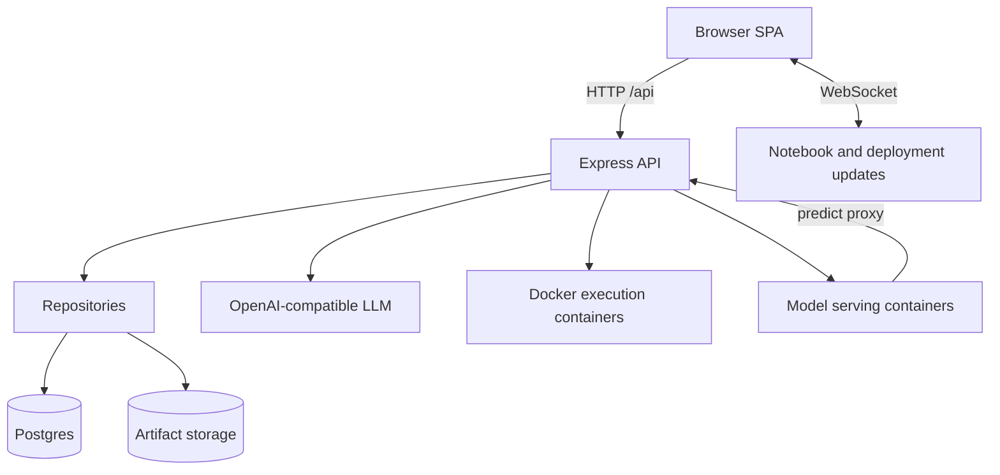

# Architecture

## Repository Layout

| Path | Purpose |
| --- | --- |
| `frontend/` | React 19 SPA, workflow UI, Zustand stores, typed API clients, Monaco-based editors. |
| `backend/` | Express 5 API, domain services, repositories, migrations, LLM/workflow orchestration, notebook runtime integration. |
| `testing/` | Playwright benchmarks, evaluation runner, benchmark catalog/staging assets. |
| `scripts/dev/` | Managed local development runner for Postgres, migrations, backend, and frontend. |
| `landing/` | Astro marketing/preview site. |
| `video/`, `poster/`, `booklet/` | Presentation and expo assets. |
| `docs/` | Repo-native supporting docs, screenshots, design notes, benchmark notes, and branding assets. |

## Runtime Boundaries

## Workflow State Model

The frontend and backend use related but not identical phase names. Keep this boundary explicit when adding or refactoring phases.

| Frontend phase | Backend workflow phase | Notes |
| --- | --- | --- |
| `upload` | `onboarding` | Planning and project setup flow. |
| `data-viewer` | none dedicated | Explorer uses query/document/dataset APIs rather than a workflow phase. |
| `preprocessing` | `preprocessing` | LLM-assisted cleaning and transformation. |
| `feature-engineering` | `feature_engineering` | Hyphen-to-underscore translation boundary. |
| `training` | `training` | LLM-assisted notebook/model training. |
| `experiments` | none dedicated | Uses model/experiment APIs. |
| `deployment` | none dedicated | Uses deployment APIs and WebSocket updates. |

## Runtime Isolation Model

Express never executes user Python in-process. User/generated Python and model serving run in Docker-managed runtimes:

- sandbox user instead of root;
- read-only root filesystem where supported;
- writable workspace/tmpfs for generated files;
- project datasets/models mounted or copied into runtime workspaces;
- configurable CPU, memory, timeout, and tmpfs limits;
- configurable Docker network, defaulting locally to `automl-sandbox`;
- prediction requests proxy through Express so auth, rate limiting, logging, and stats remain centralized.

## Backend Layers

- `routes/`: request validation and HTTP contracts mounted under `/api`.
- `services/`: domain logic for datasets, EDA, LLM, execution, notebooks, training, experiments, deployments, search, embeddings, and email.
- `repositories/`: Postgres and file-backed persistence abstractions.
- `middleware/`: auth, project access, deployment ownership/auth, request timing/context, validation, and rate limiting.
- `migrations/`: SQL schema for auth, notebooks, workflows, experiments, models, embeddings, plan chats, and deployments.

## Frontend Layers

- `pages/ProjectWorkspace.tsx`: route-level phase renderer.
- `components/layout`: shell, sidebar, plan selector, phase tree.
- `components/*`: domain components for upload, data, preprocessing, feature engineering, training, experiments, deployment, auth, settings, notebooks, and LLM chat.
- `stores/`: Zustand state for projects, auth, datasets, notebooks, preprocessing, workbooks, models, experiments, deployments, execution, and settings.
- `lib/api/`: typed fetch wrappers and streaming readers for backend APIs.
- `types/`: shared frontend domain types and phase definitions.

## Data Flow

1. The user uploads a dataset or document from the React workspace.
2. The backend parses the file, stores bytes/metadata, and loads queryable data where applicable.
3. The frontend displays derived metadata and opens phase-specific workbooks or data tabs.
4. LLM workflows use project, dataset, document, notebook, and model context to propose actions.
5. Approved actions execute through backend services and Docker-backed Python sessions.
6. Models, experiment results, and deployment metadata are persisted for comparison and serving.

## Persistence Strategy

- File-backed storage keeps project JSON, uploaded dataset bytes, document files, model artifacts, and runtime workspaces.
- PostgreSQL stores auth, ownership, query cache, document chunks/embeddings, notebooks/cells/outputs/savepoints, workflows, plan chats, models, experiments, and deployments.
- `pgvector` is used where semantic document search is configured.

## Data and Domain Model

| Area | Persistence |
| --- | --- |
| Projects and datasets | File-backed project/dataset metadata plus Postgres project ownership and loaded dataset tables. |
| Uploaded artifacts | Dataset files, document files, model artifacts, execution workspaces, and deployment workspaces under configurable storage directories. |
| Auth | `users`, `refresh_tokens`, password reset tokens, and email verification tokens. |
| Documents/RAG | `documents`, `chunks`, `embeddings`; `pgvector` semantic index when the embedding migration is applied. |
| Querying | Query results/cache and NL placeholder suggestions. |
| Notebooks | `notebooks`, `cells`, `cell_outputs`, `savepoints`; notebooks can be phase-scoped or standalone. |
| Workflows | Workflow runs, events, artifacts, approvals, handoffs, and notebook bindings. |
| Planning | Plan chat records keyed by project/user. |
| Models and experiments | Model records, tuning studies, evaluation outputs, SHAP/error-analysis artifacts. |
| Deployments | Deployments, prediction logs, hourly stats, deployment API keys. |

## LLM and Tool Orchestration

LLM-assisted workflows are exposed through streaming routes. The backend normalizes UI events, manages run records, and routes requests to tools for schema context, preprocessing decisions, feature planning, notebook code generation, and training plans. MCP-compatible routes expose tool metadata and execution surfaces.

## Execution and Notebook Model

Notebook cells are persisted in Postgres and executed through kernel/runtime services. Python execution is isolated from the Node process, supports package inspection/install, and returns structured outputs for frontend rendering.
