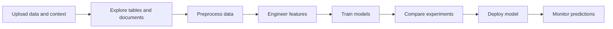
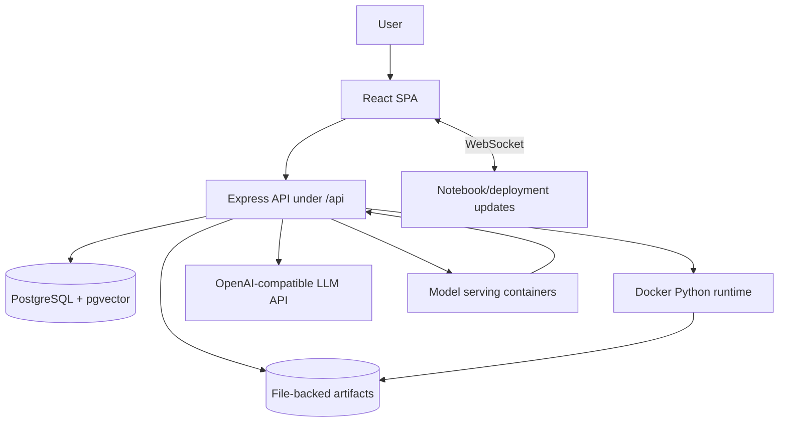

# Product Designs

## User Workflow

The UI exposes this flow as a left-sidebar phase tree. Each phase can reveal phase-specific subtabs: plan chats, uploaded files, context documents, workbooks, model records, and deployment records.

## System Context

## Major Design Decisions

- **Phase-based workflow:** upload, explorer, preprocessing, feature engineering, training, experiments, and deployment are explicit routes instead of a generic dashboard.
- **Human-in-the-loop automation:** LLM workflows stream their progress and generate proposed actions/code; the user can approve, edit, retry, or interrupt.
- **Notebook-centered execution:** preprocessing, feature engineering, and training reuse workbook concepts so generated code remains visible and reproducible.
- **Hybrid persistence:** large artifacts remain file-backed, while queryable metadata, auth, embeddings, notebooks, workflows, models, and deployments live in Postgres.
- **Sandboxed Python:** user and generated Python code executes outside the Node process in Docker with resource controls.
- **Typed frontend integration:** `frontend/src/lib/api` wraps backend contracts and Zustand stores own local workflow state.

## UX Patterns

- Dense workbench layouts over marketing-style pages.
- Sidebar phase tree for navigation and progress.
- Monaco editors for SQL and Python.
- Streaming status cards for LLM and long-running workflows.
- Approval gates for generated transformations and training actions.
- Tables, leaderboards, charts, logs, and detail panels for scan-heavy ML operations.
- Project color theming through `projectColorClasses` and active project state.

## Screen References

Current repo screenshots are stored under `docs/screenshots/`:

| Screen | Repo path |
| --- | --- |
| Upload and planning | `docs/screenshots/upload.png` |
| EDA / Explorer | `docs/screenshots/eda.png` and `docs/screenshots/sprint8/eda-dashboard.png` |
| NL-to-SQL | `docs/screenshots/nl-to-sql.png` |
| Preprocessing | `docs/screenshots/preprocessing.png` |
| Training | `docs/screenshots/training.png` |
| Experiments | `docs/screenshots/experiments.png` and `docs/screenshots/sprint8/experiments-tuning.png` |
| Voice input | `docs/screenshots/sprint8/voice-input.png` |

## Interaction Models

- **Phase unlocking:** projects move through a fixed sequence; locked phases redirect to the current allowed phase.
- **Approval gates:** generated project plans, SQL, transformations, features, and model plans require user review or explicit execution.
- **Streaming workflows:** LLM and NL-to-SQL operations stream progress events so users can inspect intermediate reasoning and interrupt long runs.
- **Workbook/notebook recovery:** preprocessing, feature engineering, and training preserve phase-scoped notebook sessions, savepoints, and recovery candidates.
- **Deployment lifecycle:** deployment records move through create, start, ready, predict, monitor, stop/restart/delete, with prediction proxying centralized through the backend.
