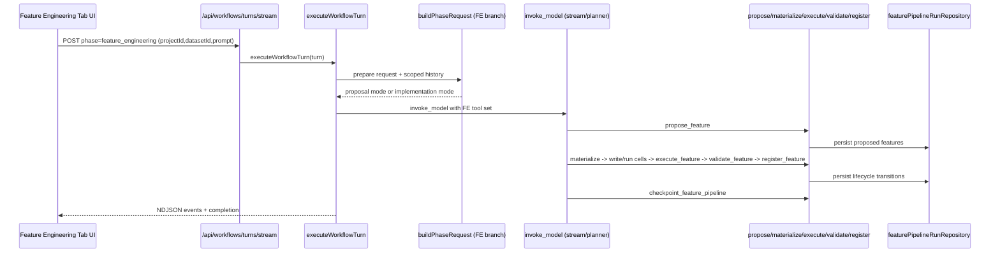

# Feature Engineering Tab Backend Deep Dive

Related docs:

- [Backend Workflow Deep Dive Index](./backend-workflow-deep-dive-index.md)
- [Processing Tab Backend Deep Dive](./processing-tab-backend-deep-dive.md)
- [Training Tab Backend Deep Dive](./training-tab-backend-deep-dive.md)

## 1. Scope

This document explains how the backend implements the Feature Engineering tab (`phase = feature_engineering`) in current code:

- API entry points
- shared workflow orchestration
- FE phase lifecycle/tools
- notebook execution and persistence
- FE dataset materialization
- FE -> Training handoff semantics
- failure and guardrail behavior

## 2. Backend Entry Points

### 2.1 Unified workflow stream

File: `backend/src/routes/workflows.ts`

- `POST /api/workflows/turns/stream`
  - accepts `phase = feature_engineering`
  - validates `projectId`, optional `datasetId`, `notebookId`, `targetColumn`, `prompt`, etc
  - NDJSON stream response
  - concurrent run guard (`409 WORKFLOW_ALREADY_RUNNING`) for fresh runs
- `POST /api/workflows/:runId/interrupt`
- `GET /api/workflows`
- `GET /api/workflows/:runId`

### 2.2 FE-specific routes

File: `backend/src/routes/featureEngineering.ts`

- `POST /api/feature-engineering/apply`
  - validates `projectId`, `datasetId`, `features[]`
  - each feature method is constrained to `FEATURE_METHODS`
  - optional LLM-authored code capped at 50KB
  - returns derived dataset payload (`201`)
- `GET /api/feature-engineering/runs`
  - list run snapshots by project
- `GET /api/feature-engineering/runs/:runId`
  - fetch one FE run snapshot

## 3. Shared Workflow Engine Path

Core files:

- `backend/src/services/workflows/turnExecutor.ts`
- `backend/src/services/workflows/graph.ts`
- `backend/src/services/workflows/phaseRequestBuilder.ts`
- `backend/src/services/workflows/modelTurnCollector.ts`
- `backend/src/services/workflows/toolExecutor.ts`

Execution path:

1. route validates request and resolves phase config
2. `executeWorkflowTurn` creates/loads run and restores tool history
3. graph loop:
   - `prepare` (phase request)
   - `invoke_model`
   - `execute_tools`
4. terminal state persisted and emitted

## 4. FE PhaseConfig and Lifecycle

Primary file: `backend/src/services/workflows/phases/featureEngineering.ts`

### 4.1 Lifecycle stages

Configured lifecycle:

1. `answer`
2. `analyze_data`
3. `propose_feature`
4. `generate_code`
5. `write_code`
6. `execute_feature`
7. `validate_feature`
8. `await_review`
9. `register_feature`
10. `summarize`

Operational stage used in request builder path: `continue_feature_pipeline` (text mode).

### 4.2 Stage behavior

- `continue_feature_pipeline`:
  - text mode
  - uses `LLM_FEATURE_CONTINUE_TOOLS`
- phase-specific tool dispatch:
  - `isPhaseSpecificTool` checks tool against `FEATURE_TOOL_NAMES`
- transition:
  - `resolveNextStage` moves forward by lifecycle order
  - explicit repair loop: execution failure routes `execute_feature` back to `generate_code`

## 5. LLM Orchestration and FE Tool Lifecycle

### 5.1 Contracts, prompts, tools

- prompt contract:
  - `backend/src/services/llm/prompts/featureContract.ts`
  - `backend/src/services/llm/prompts/featureWorkflow.ts`
- tool schemas:
  - `backend/src/services/llm/tools/featureTools.ts`
- tool registry:
  - `backend/src/services/llm/featureTools/index.ts`

### 5.2 Lifecycle tools

- `propose_feature`, `materialize_feature_code`
  - `proposalTools.ts`
- `execute_feature`, `validate_feature`
  - `executionTools.ts`
- `register_feature`, `checkpoint_feature_pipeline`
  - `registrationTools.ts`

### 5.3 Phase-request builder FE logic

File: `backend/src/services/workflows/phaseRequestBuilder.ts`

Key FE-specific behavior:

- trims history aggressively for FE to avoid context loops
- filters out `get_dataset_profile` noise for continuation prompts
- proposal-only mode when prompt does not include selected feature IDs
- when current-turn lifecycle output is proposal-only:
  - short-circuits to deterministic UI payload (feature suggestion cards)
- when successful `checkpoint_feature_pipeline` is last lifecycle event in current turn:
  - short-circuits to `complete`

## 6. Notebook and Runtime Interactions

### 6.1 Tool execution and notebook writes

File: `backend/src/services/workflows/toolExecutor.ts`

For FE lifecycle runs:

- injects `datasetId`, `notebookId`, and workflow `runId` into tool args
- FE tools are dispatched through phase config handlers
- FE notebook chaining supports load/materialize/execute pattern using helpers:
  - `buildFeatureLoadCell`
  - `buildFeatureCodeCellTitle`

### 6.2 Notebook execution pipeline

Key files:

- `backend/src/services/notebook/cellExecutionService.ts`
- `backend/src/services/llm/toolHandlers/cellHandlers.ts`

Behavior:

- validates project ownership
- enforces phase-notebook restriction for LLM tools
- executes in container kernel
- persists output and output references
- emits websocket progress events
- handles timeout recovery

## 7. FE Persistence Model

### 7.1 FE run repository

File: `backend/src/repositories/featurePipelineRunRepository.ts`

FE run state stores:

- `runId`, `projectId`, optional scoped notebook id
- `features: Record<featureId, FeatureStepRecord>`
- feature statuses and code/execution/validation metadata
- checkpoint metadata
- timestamps

Status model includes:

- `proposed`
- `code_ready`
- `executed`
- `failed`
- `validated`
- `registered`
- `rejected`

### 7.2 Shared workflow persistence

Still persists run/event/artifact metadata in workflow repository:

- `workflow_runs`
- `workflow_events`
- `workflow_artifacts`

FE run state and workflow run state are separate stores with different responsibility.

## 8. FE Data Movement and Handoff

### 8.1 Into FE

- source dataset is selected by `datasetId` in workflow turn
- FE prompt receives dataset schema and context
- tool executor propagates active dataset and notebook ids

### 8.2 FE internal outputs

- lifecycle state written to FE run repository
- execution outputs written to notebook storage and workflow events

### 8.3 FE dataset materialization

File: `backend/src/services/featureEngineering.ts`

`applyFeatureEngineering(...)`:

1. runs generated FE code in Python runtime
2. writes transformed output file and metadata sidecar
3. enforces hard guard: at least one new column must be produced
4. creates derived dataset metadata (`metadata.derivedFrom`, FE metadata)
5. optional SQL load path

### 8.4 FE -> Training

Current handoff semantics:

- Training does not read FE run repository directly for lifecycle state.
- Training consumes:
  - selected `datasetId` and `targetColumn` from training turn
  - optional `featureSummary`
  - `project.metadata.features` when present
- `configure_experiment` can auto-populate feature columns from available metadata.

Practical effect:

- strongest handoff is the derived dataset selected by client for Training tab
- feature metadata is supplemental context, not exclusive source of truth

## 9. Failure, Retry, and Guardrails

### 9.1 Workflow-level

- concurrent-run guard for new turns
- persisted retryable/terminal failures
- standardized error event emission

### 9.2 Model-output robustness

`modelTurnCollector.ts` includes FE-specific stall handling:

- detects text-only FE responses when selected features remain unregistered
- retries once with hardened instruction requiring tool call
- fails with `MODEL_TOOL_OUTPUT_INVALID` if still stalled

### 9.3 Tool-loop protections

- iteration and per-tool caps from `graphState.ts` enforced in `toolExecutor.ts`

### 9.4 Validation invariants in FE tools

- proposal source columns must exist in active dataset schema
- `propose_feature` blocked in implementation mode (selected IDs prompt)
- materialized code must be actionable and produce valid output columns
- register requires validated successful execution
- apply-time guard rejects no-new-column output

## 10. End-to-End Sequences

### 10.1 Proposal/review path

1. FE tab sends workflow stream request
2. prepare builds FE proposal request and scoped history
3. model proposes features via `propose_feature`
4. request builder detects proposal-only turn and returns UI payload directly
5. frontend shows enable/disable cards

### 10.2 Implementation path

1. user sends selected feature IDs in follow-up prompt
2. model/tool chain runs `materialize_feature_code -> write/run cells -> execute_feature -> validate_feature -> register_feature`
3. pipeline checkpoint finalizes turn
4. workflow emits completion state/events

### 10.3 Persist transformed dataset for downstream use

1. user calls `POST /api/feature-engineering/apply`
2. backend runs FE script and creates derived dataset
3. Training tab uses that derived dataset id in subsequent training turn

## 11. File Index (FE-Critical)

- `backend/src/routes/featureEngineering.ts`
- `backend/src/routes/workflows.ts`
- `backend/src/services/workflows/phases/featureEngineering.ts`
- `backend/src/services/workflows/phaseRequestBuilder.ts`
- `backend/src/services/workflows/toolExecutor.ts`
- `backend/src/services/workflows/modelTurnCollector.ts`
- `backend/src/services/llm/prompts/featureContract.ts`
- `backend/src/services/llm/prompts/featureWorkflow.ts`
- `backend/src/services/llm/tools/featureTools.ts`
- `backend/src/services/llm/featureTools/proposalTools.ts`
- `backend/src/services/llm/featureTools/executionTools.ts`
- `backend/src/services/llm/featureTools/registrationTools.ts`
- `backend/src/repositories/featurePipelineRunRepository.ts`
- `backend/src/services/featureEngineering.ts`

## 12. Mermaid Lifecycle Diagram (Feature Engineering)

## 13. Shared LangChain Tool-Call Plumbing

The shared request/tool embedding path is documented centrally in:

- [Backend Workflow Deep Dive Index](./backend-workflow-deep-dive-index.md)
  - section: `How LangChain Tool Calls Are Embedded and Executed`
