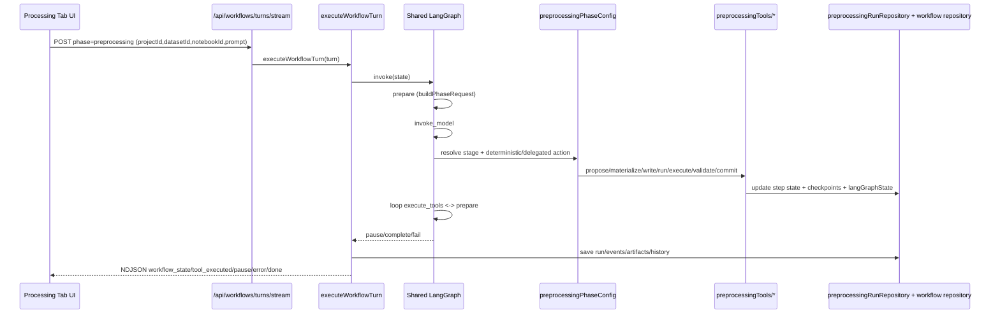

# Processing Tab Backend Deep Dive

Related docs:

- [Backend Workflow Deep Dive Index](./backend-workflow-deep-dive-index.md)
- [Feature Engineering Tab Backend Deep Dive](./feature-engineering-tab-backend-deep-dive.md)
- [Training Tab Backend Deep Dive](./training-tab-backend-deep-dive.md)

## 1. Scope

This document explains the backend implementation for the Processing tab (`phase = preprocessing`) in the current codebase. It covers:

- backend entry points and request/response contracts
- shared workflow/LangGraph orchestration
- preprocessing-specific LangGraph/runtime/controller behavior
- tool lifecycle and deterministic/delegated stage actions
- state persistence and lineage
- data movement into/out of preprocessing and handoff to later phases
- failure, retry, pause, and interruption behavior

This document is derived from code, not historical markdown notes.

## 2. Main Backend Entry Points

### 2.1 Unified workflow stream API

File: `backend/src/routes/workflows.ts`

- `POST /api/workflows/turns/stream`
  - Validates `workflowTurnSchema`:
    - required: `projectId`, `phase`
    - optional: `prompt`, `runId`, `threadId`, `datasetId`, `notebookId`, `targetColumn`, `featureSummary`, `reasoningEffort`, `model`
  - For new runs (no `runId`), blocks concurrent active run with:
    - `409 WORKFLOW_ALREADY_RUNNING` unless existing run is stale (>10 min)
  - Creates NDJSON stream and delegates to `executeWorkflowTurn(...)`
- `POST /api/workflows/:runId/interrupt`
  - Marks active run (`running|paused`) as `interrupted`
  - Appends `workflow_interrupted` event
- `GET /api/workflows`
  - Lists runs by `projectId` and optional `phase`
- `GET /api/workflows/:runId`
  - Returns full run snapshot

### 2.2 Preprocessing-specific API surface

File: `backend/src/routes/preprocessing.ts`

- `GET /api/preprocessing/tables`
  - Returns table summaries for project datasets
- `POST /api/preprocessing/step-decision`
  - User approval/rejection endpoint
  - Converts decision to `commit_transformation_step` tool invocation with `approvalSource: "user"`
- `POST /api/preprocessing/check-compatibility`
  - Calls `restore_checkpoint` with `operation: "compatibility_check"`
- `GET /api/preprocessing/runs`
  - Lists preprocessing run snapshots
- `GET /api/preprocessing/runs/:runId`
  - Returns one preprocessing run snapshot

## 3. Shared Workflow Engine Used by Processing

### 3.1 Turn executor and graph

Core files:

- `backend/src/services/workflows/turnExecutor.ts`
- `backend/src/services/workflows/graph.ts`
- `backend/src/services/workflows/graphState.ts`

Flow:

1. Resolve/create run state
2. Restore tool history from run metadata (`history.ts`) for continuation semantics
3. Emit initial `workflow_state`
4. Invoke compiled shared LangGraph graph:
   - `prepare` -> `invoke_model` -> `execute_tools` loop
   - terminal nodes: `pause`, `complete`, `fail`
5. Persist final run state and events
6. Emit terminal NDJSON event (`done`)

### 3.2 Phase request build

File: `backend/src/services/workflows/phaseRequestBuilder.ts`

For preprocessing turns:

- requires valid `datasetId` (otherwise `DATASET_NOT_FOUND`/`DATASET_REQUIRED`)
- invokes preprocessing controller resolution (`resolvePreprocessingControllerTurn`)
- sets request for model node and updates run node/thread metadata
- continuation behavior:
  - `shouldContinuePreprocessingTurn(...)` allows no-prompt continuation when prior history exists and run was already active

### 3.3 Model node + tool node

Files:

- `backend/src/services/workflows/modelTurnCollector.ts`
- `backend/src/services/workflows/toolExecutor.ts`

Model node:

- handles planner/text/delegated/deterministic execution paths based on stage contract
- parses streamed tool calls/ask_user/plan_exit/render_ui
- retries first-iteration empty stream once

Tool node:

- executes tool calls
- emits `tool_executed` events
- enforces loop limits:
  - `MAX_WORKFLOW_ITERATIONS = 48`
  - `MAX_SINGLE_TOOL_CALLS = 10`
  - `MAX_IDENTICAL_TOOL_CALLS = 5`

## 4. Preprocessing PhaseConfig and Lifecycle

Primary file: `backend/src/services/workflows/phases/preprocessing.ts`  
Lifecycle definitions: `backend/src/services/workflows/phases/preprocessing/stageConfig.ts`  
Transition logic: `backend/src/services/workflows/phases/preprocessing/transition.ts`

### 4.1 Lifecycle stages

Ordered lifecycle:

1. `answer`
2. `plan_step`
3. `generate_code`
4. `write_code`
5. `record_execution`
6. `validate`
7. `await_approval`
8. `commit`
9. `summarize`

### 4.2 Stage modes

- `generate_code`: `llm_delegated`
- `write_code`, `record_execution`, `validate`, `commit`: `deterministic`
- `answer`, `await_approval`, `summarize`: `text`
- `plan_step`: `action`

### 4.3 Stage tool allowlists

Defined in `stageConfig.ts` (`STAGE_TOOLS`), for example:

- `plan_step`: `list_project_datasets`, `set_active_dataset`, `profile_active_dataset`, `propose_transformation_step`, notebook read/list
- `generate_code`: `materialize_step_code`
- `write_code`: notebook write/run/list/read
- `record_execution`: `execute_transformation_step` (+ notebook read/list)
- `validate`: `validate_step_result` (+ profile/read)
- `commit`: `commit_transformation_step`, `checkpoint_dataset`

### 4.4 Deterministic action functions

In `preprocessing.ts`:

- `buildWriteCodeAction`
  - splits materialized code into segments (`splitMaterializedStepCode`)
  - writes/reuses notebook cells with preprocessing lineage metadata
  - runs cells in order
- `buildRecordExecutionAction`
  - collects `run_cell` outcomes
  - resolves notebook status and stdout/stderr
  - emits `execute_transformation_step`
- `buildValidateAction`
  - emits `validate_step_result`
  - currently sets `requiresApproval: false` for auto-advance on pass
- `buildCommitAction`
  - emits `commit_transformation_step` against active dataset
- `buildCodeGenerationAction` (delegated)
  - calls model to generate Python
  - emits `materialize_step_code`

## 5. Preprocessing Tool Lifecycle (Domain Logic)

Tool handlers map: `backend/src/services/llm/preprocessingTools/index.ts`

Core lifecycle tools and logic:

- `propose_transformation_step`
  - `transformationTools.ts`
  - enforces single incomplete step (`RUN_HAS_INCOMPLETE_STEP`)
- `materialize_step_code`
  - stores code, hash, version
  - resets downstream execution/validation state as needed
- `execute_transformation_step`
  - records cell ids, stdout/stderr, execution flags
- `validate_step_result`
  - requires successful execution and valid cell linkage
  - can produce approval wait state
- `commit_transformation_step`
  - approval path: persists processed dataset + checkpoint, marks step applied
  - rejection path: marks step rejected/failed
- divergence helpers
  - `divergenceTools.ts`: detect/reconcile out-of-band edits (`absorb_edit`, `create_linked_step`)

## 6. LangGraph / LangChain Preprocessing-Specific Orchestration

### 6.1 Controller graph

Files:

- `backend/src/services/llm/preprocessing/controller.ts`
- `backend/src/services/llm/preprocessing/turnClassification.ts`
- `backend/src/services/llm/preprocessing/controllerRouting.ts`

Behavior:

- classifies turn intent (`answer_only` vs `action_required`, fallback to action)
- routes controller state to proper node
- produces `controllerSummary` consumed by shared workflow prepare/invoke path

### 6.2 Runtime state machine and sync bridge

Files:

- `backend/src/services/llm/langgraph/preprocessingRuntime.ts`
- `backend/src/services/llm/preprocessing/stateSync.ts`

Behavior:

- maintains preprocessing runtime stages and consistency
- applies tool-result-driven transitions
- supports bounded auto-repair attempts
- persists runtime graph state into preprocessing run (`langGraphState`)

## 7. Persistence and State Model

### 7.1 Shared workflow persistence

Files:

- `backend/src/services/workflows/repository/types.ts`
- `backend/src/services/workflows/repository/postgres.ts`
- `backend/src/services/workflows/repository/inMemory.ts`
- migration: `backend/migrations/007_workflows.sql`

Persisted entities:

- `workflow_runs`, `workflow_events`, `workflow_artifacts`, `workflow_approvals`, `workflow_handoffs`, `workflow_notebook_bindings`

### 7.2 Preprocessing-specific persistence

File: `backend/src/repositories/preprocessingRunRepository.ts`

Stores per-run:

- steps and statuses
- checkpoints
- events
- active dataset id
- derived dataset ids
- `langGraphState` snapshot

### 7.3 Notebook lineage binding

Files:

- `backend/src/services/llm/preprocessing/cellBinding.ts`
- notebook repositories/services under `backend/src/services/notebook/*`

Purpose:

- tie step ids and run ids to notebook cells and execution outputs

## 8. Data Movement and Handoff to Next Phases

### 8.1 Input data path

- source files in `datasetStorageDir/<datasetId>/<filename>`
- copied into execution workspace via `datasetWorkspace.ts`
- kernels read/write through helpers injected by `kernelManager.ts` init code

### 8.2 Processed data persistence

Commit path:

1. `commit_transformation_step` -> `stepCommitHandler.ts`
2. `persistProcessedDataset(...)` in `processedDatasetPersistence.ts`
3. create/update derived dataset metadata
4. copy file to storage (`datasetStorageDir/<derivedDatasetId>/<processedFilename>`)
5. optionally load table into Postgres (`datasetLoader.ts`)
6. update preprocessing run `activeDatasetId` to derived dataset

### 8.3 How next phases receive preprocessing output

Important current behavior:

- preprocessing backend returns `derivedDatasetId`
- later FE/training turns use whichever `datasetId` the client sends in new workflow turn
- backend does not auto-overwrite future turn `datasetId` with preprocessing run `activeDatasetId`
- training side still validates prompt-vs-selection consistency (`detectTrainingSelectionMismatch`)

## 9. Failure, Retry, Pause, and Interrupt Behavior

- global run-state persistence and error normalization in `turnExecutor.ts`
- failure classification in `turnState.ts`:
  - retryable vs terminal
- approval pauses surfaced as `workflow_pause` with `pendingInputKind = approval`
- loop/recursion protections in `toolExecutor.ts` + `graphState.ts`
- interrupt route marks run interrupted (`/workflows/:runId/interrupt`)
- notebook timeout recovery in `cellExecutionService.ts` (interrupt/restart kernel)

## 10. End-to-End Sequences

### 10.1 Standard preprocessing execution

1. Client calls `POST /api/workflows/turns/stream` (`phase=preprocessing`, `datasetId`, `notebookId`, prompt)
2. Shared graph enters `prepare`
3. Preprocessing controller builds request + stage
4. Model/delegated stages propose/materialize/write/run
5. Deterministic stages record execution -> validate -> commit
6. Commit persists derived dataset + checkpoint
7. Run finalizer emits state/artifacts/summary and closes stream

### 10.2 Approval/rejection via step-decision API

1. Client calls `POST /api/preprocessing/step-decision`
2. Route executes `commit_transformation_step` with `approvalSource: user`
3. Sync bridge updates preprocessing runtime state
4. Route returns normalized tool result payload

### 10.3 Resume after pause/failure

1. Client sends follow-up turn with same `runId`
2. Executor restores persisted tool history from run metadata
3. Stage resolution continues lifecycle instead of full restart when applicable
4. Run proceeds until complete/pause/fail

## 11. File Index (Processing-Critical)

- `backend/src/routes/workflows.ts`
- `backend/src/routes/preprocessing.ts`
- `backend/src/services/workflows/turnExecutor.ts`
- `backend/src/services/workflows/graph.ts`
- `backend/src/services/workflows/phaseRequestBuilder.ts`
- `backend/src/services/workflows/toolExecutor.ts`
- `backend/src/services/workflows/modelTurnCollector.ts`
- `backend/src/services/workflows/phases/preprocessing.ts`
- `backend/src/services/workflows/phases/preprocessing/stageConfig.ts`
- `backend/src/services/workflows/phases/preprocessing/transition.ts`
- `backend/src/services/llm/preprocessing/controller.ts`
- `backend/src/services/llm/preprocessing/stateSync.ts`
- `backend/src/services/llm/langgraph/preprocessingRuntime.ts`
- `backend/src/services/llm/preprocessingTools/*`
- `backend/src/repositories/preprocessingRunRepository.ts`
- `backend/src/services/llm/preprocessingTools/processedDatasetPersistence.ts`

## 12. Mermaid Lifecycle Diagram (Processing)

## 13. Shared LangChain Tool-Call Plumbing

Processing-specific details are in this document, but the shared tool-call request embedding path is documented centrally in:

- [Backend Workflow Deep Dive Index](./backend-workflow-deep-dive-index.md)
  - section: `How LangChain Tool Calls Are Embedded and Executed`
