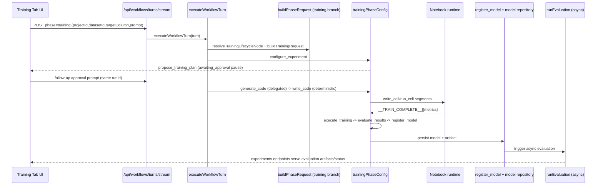

# Training Tab Backend Deep Dive

Related docs:

- [Backend Workflow Deep Dive Index](./backend-workflow-deep-dive-index.md)
- [Processing Tab Backend Deep Dive](./processing-tab-backend-deep-dive.md)
- [Feature Engineering Tab Backend Deep Dive](./feature-engineering-tab-backend-deep-dive.md)

## 1. Scope

This document explains the current backend implementation for the Training tab (`phase = training`):

- request entry points and schemas
- shared workflow orchestration path
- training lifecycle tools and stage engine
- notebook execution and metrics capture
- experiment/model persistence and evaluation pipeline
- data movement from preprocessing/FE into training
- error handling, pause/resume, and guardrails

## 2. Backend Entry Points

### 2.1 Training through unified workflow stream

File: `backend/src/routes/workflows.ts`

- `POST /api/workflows/turns/stream`
  - accepts `phase = training`
  - key optional fields for training: `datasetId`, `notebookId`, `targetColumn`, `featureSummary`, `prompt`
  - NDJSON event stream response
  - active-run concurrency guard for fresh turns
- `POST /api/workflows/:runId/interrupt`
- `GET /api/workflows`
- `GET /api/workflows/:runId`

### 2.2 Direct model and experiment APIs

Files:

- `backend/src/routes/models.ts`
- `backend/src/routes/experiments.ts`

Used for:

- direct non-workflow training requests (`/api/models/train`)
- model registry reads/artifact retrieval
- evaluation details, compare, insights, tuning, error analysis

### 2.3 Notebook run endpoint used by workflow tools

File: `backend/src/routes/notebooks/cellRoutes.ts`

- `POST /api/cells/:cellId/run` with project validation
- this is the runtime bridge for workflow-generated training code cells

## 3. Shared Workflow Orchestration for Training

Core files:

- `backend/src/services/workflows/turnExecutor.ts`
- `backend/src/services/workflows/graph.ts`
- `backend/src/services/workflows/phaseRequestBuilder.ts`
- `backend/src/services/workflows/modelTurnCollector.ts`
- `backend/src/services/workflows/toolExecutor.ts`

Graph pattern:

1. `prepare` (`buildPhaseRequest`)
2. `invoke_model` (`invokeModelNode`)
3. `execute_tools` (`executeToolsNode`)
4. loop until `pause|complete|fail`

Run metadata keeps tool history so continuation turns can resume lifecycle context.

## 4. Training Request Build and Stage Resolution

File: `backend/src/services/workflows/phaseRequestBuilder.ts`

Training-specific prepare behavior:

- validates selected controls vs prompt intent:
  - `detectTrainingSelectionMismatch(...)`
  - returns terminal `TRAINING_SELECTION_MISMATCH` if prompt conflicts with selected dataset/target
- resolves active lifecycle node:
  - `resolveTrainingLifecycleNode(...)`
- builds prompt request:
  - `buildTrainingRequest(...)`
- short-circuits completion when last lifecycle tool in current turn is successful `register_model` and no pending approved experiments remain

### 4.1 Important paused-resume behavior

Current code includes fail-closed resume behavior for proposal-stage pauses:

- paused runs at `propose_model` only advance to `generate_code` when approval text matches explicit selected-model approval parsing (`parseApprovedTrainingExperimentNames`)
- generic continuation/rejection text does not auto-jump into codegen

This is implemented in `resolveTrainingLifecycleNode(...)` and aligns with recent updates captured in `chat_history.md`.

## 5. Training PhaseConfig and Lifecycle Engine

Primary file: `backend/src/services/workflows/phases/training.ts`

### 5.1 Lifecycle stages

Configured order:

1. `answer`
2. `configure_experiment`
3. `propose_model`
4. `generate_code`
5. `write_code`
6. `execute_training`
7. `evaluate_results`
8. `await_review`
9. `register_model`
10. `summarize`

### 5.2 Stage modes

- `generate_code`: `llm_delegated`
- `write_code`: deterministic
- `execute_training`: deterministic
- `evaluate_results`: deterministic
- `register_model`: deterministic
- other stages: text

### 5.3 Stage tool allowlists

`STAGE_TOOL_ALLOWLIST` in `training.ts` constrains available tools by stage.

Examples:

- `configure_experiment`: config tool + discovery tools
- `propose_model`: configure/propose + discovery
- `generate_code|write_code`: notebook authoring/execution tools (+ package install)
- `execute_training`: `execute_training` only
- `evaluate_results`: `evaluate_results` only
- `register_model`: `register_model` only

## 6. Training Tool Lifecycle

Tool schemas:

- `backend/src/services/llm/tools/trainingTools.ts`

Handlers:

- `backend/src/services/llm/trainingTools/index.ts`

Core lifecycle:

1. `configure_experiment`
   - validates experiment definition and constraints
2. `propose_training_plan`
   - returns proposal payload with `awaiting_approval` semantics
3. code generation + notebook execution (`write_cell`/`run_cell`)
4. `execute_training`
   - records successful training metrics
5. `evaluate_results`
   - normalizes/records evaluation metrics
6. `register_model`
   - persists model and artifact, schedules evaluation pipeline
7. optional `compare_models`

## 7. Deterministic/Delegated Action Details

In `training.ts`:

- delegated codegen:
  - `buildTrainingCodeGenerationAction(...)`
  - generates segmented code (`splitTrainingGeneratedCode`)
  - auto-installs missing runtime deps when needed
  - retries specific repairs with bounded attempts (`MAX_TRAINING_REPAIR_ATTEMPTS = 3`)
- deterministic notebook flow:
  - `buildTrainingWriteCodeAction(...)`
  - writes next draft segment or runs next cell
  - appends deterministic finalization segment if completion marker/artifact-save contract is incomplete
- deterministic metric promotion:
  - `buildTrainingExecuteAction(...)`
  - parses stdout marker `__TRAIN_COMPLETE__|{json}`
  - emits `execute_training`
- deterministic evaluate/register:
  - `buildTrainingEvaluateAction(...)`
  - `buildTrainingRegisterAction(...)`

## 8. Notebook Execution and Metric Extraction

Notebook runtime:

- `backend/src/services/notebook/cellExecutionService.ts`

Behavior:

- project/cell validation and locking
- dataset sync to execution workspace
- container kernel execution
- timeout handling and kernel restart path
- output persistence (inline and externalized refs)

Training metric extraction:

- `parseTrainCompleteMetrics(...)` in `training.ts`
- extracts JSON after `__TRAIN_COMPLETE__|`
- used to auto-call `execute_training`

## 9. Experiment and Model Persistence

### 9.1 Workflow run persistence

Files:

- `backend/src/services/workflows/repository/types.ts`
- `backend/src/services/workflows/repository/postgres.ts`
- `backend/src/services/workflows/repository/inMemory.ts`

Training run lifecycle state is persisted in workflow run + events/artifacts.

### 9.2 Experiment state in workflow metadata

- experiment lifecycle records are stored under `run.metadata.experiments`
- tool handlers mutate and save this map across turns

### 9.3 Model registration and artifact persistence

File: `backend/src/services/llm/trainingTools/registrationTools.ts`

`registerModel(...)`:

1. validates `experimentId`, metrics, artifact path constraints
2. creates model repo row (`evaluationStatus: pending`)
3. copies artifact from workspace to permanent model storage
4. updates experiment metadata with persisted model id
5. triggers async evaluation (`runEvaluation(modelId)`)

Evaluation pipeline:

- `backend/src/services/evaluationService.ts`
- writes evaluation artifacts consumed by experiments APIs

## 10. Data Movement from Preprocessing/FE into Training

### 10.1 Source selection for training turn

Training request takes `datasetId` and `targetColumn` from current turn payload.

Prompt templates in:

- `backend/src/services/llm/prompts/trainingWorkflow.ts`
- use selected controls as authoritative context

### 10.2 Preprocessing handoff

Preprocessing commit persists derived dataset and returns `derivedDatasetId`.

Training consumes that output only when client sends it as next training turn `datasetId`.

Backend does not auto-inject preprocessing run `activeDatasetId` into future training requests.

### 10.3 Feature Engineering handoff

Two paths:

- primary: FE-derived dataset selected in Training tab
- supplemental: `project.metadata.features` and optional `featureSummary` used by training config/prompt logic

`configure_experiment` may auto-select feature columns from FE metadata when available.

## 11. Failure, Pause/Resume, and Guardrails

### 11.1 Global run failure handling

- normalized error persistence in `turnExecutor.ts`
- retryable vs terminal mapping in `turnState.ts`
- workflow error events emitted to client stream

### 11.2 Training-specific guardrails in tool executor

File: `backend/src/services/workflows/toolExecutor.ts`

During training execution stages:

- disallow `list_cells`/`read_cell`
- disallow markdown notebook cells
- enforce max training code cell length
- detect and block GPU/MPS/CUDA device usage patterns
- validate referenced dataset filename/target column against selected controls

### 11.3 Loop and recursion protection

- iteration/tool caps from `graphState.ts`
- identical-call loop detection
- deterministic/delegated empty-output hard failures (`DETERMINISTIC_ACTION_EMPTY`, `DELEGATED_ACTION_EMPTY`)

### 11.4 Pause and approval model

- approval is represented as workflow pause (`pendingInputKind: approval`)
- resume depends on parsed approval text selection patterns (`trainingExperimentSelection.ts`)

### 11.5 Interrupt and dataset-in-use protections

- workflow interrupt route marks run interrupted
- dataset deletion route protects datasets used by active runs (`DATASET_IN_USE`)

## 12. End-to-End Sequences

### 12.1 Configure/propose/approval

1. client sends training turn
2. model configures experiment(s)
3. model emits `propose_training_plan`
4. workflow pauses awaiting approval
5. client sends approval follow-up with same `runId`

### 12.2 Codegen/execution/evaluate/register

1. delegated codegen emits first draft `write_cell`
2. deterministic stage chains writes/runs through draft segments
3. completion marker parsed, auto `execute_training`
4. deterministic auto `evaluate_results`
5. deterministic auto `register_model`
6. model saved + async evaluation scheduled

### 12.3 Experiments consumption

1. evaluation service produces artifacts
2. experiments endpoints serve evaluation/shap/compare/etc
3. frontend reads model + evaluation status from APIs

## 13. File Index (Training-Critical)

- `backend/src/routes/workflows.ts`
- `backend/src/routes/models.ts`
- `backend/src/routes/experiments.ts`
- `backend/src/services/workflows/phaseRequestBuilder.ts`
- `backend/src/services/workflows/phases/training.ts`
- `backend/src/services/workflows/toolExecutor.ts`
- `backend/src/services/workflows/modelTurnCollector.ts`
- `backend/src/services/workflows/trainingExperimentSelection.ts`
- `backend/src/services/llm/tools/trainingTools.ts`
- `backend/src/services/llm/trainingTools/experimentTools.ts`
- `backend/src/services/llm/trainingTools/executionTools.ts`
- `backend/src/services/llm/trainingTools/registrationTools.ts`
- `backend/src/services/notebook/cellExecutionService.ts`
- `backend/src/services/evaluationService.ts`

## 14. Mermaid Lifecycle Diagram (Training)

## 15. Shared LangChain Tool-Call Plumbing

The shared request/tool embedding path is documented centrally in:

- [Backend Workflow Deep Dive Index](./backend-workflow-deep-dive-index.md)
  - section: `How LangChain Tool Calls Are Embedded and Executed`
